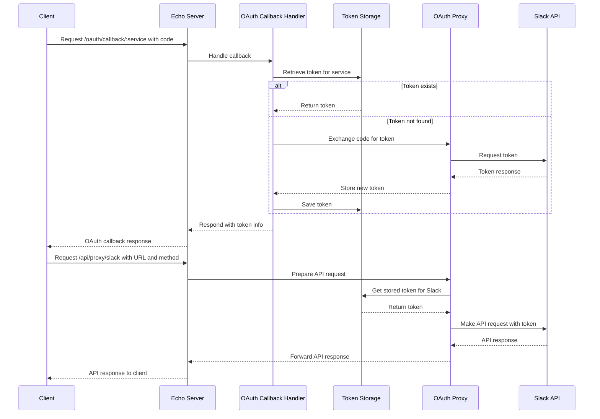

###

```mermaid
sequenceDiagram
    participant Client
    participant EchoServer as Echo Server
    participant OAuthHandler as OAuth Callback Handler
    participant TokenStorage
    participant OAuthProxy
    participant SlackAPI as Slack API

    Client->>+EchoServer: Request /oauth/callback/:service with code
    EchoServer->>+OAuthHandler: Handle callback
    OAuthHandler->>+TokenStorage: Get stored token for service
    alt Token found
        TokenStorage-->>-OAuthHandler: Return token
    else Token not found
        OAuthHandler->>+OAuthProxy: Exchange code for token
        OAuthProxy->>+SlackAPI: POST to TokenURL
        SlackAPI-->>-OAuthProxy: Access token
        OAuthProxy-->>-OAuthHandler: Store and return token
        OAuthHandler->>TokenStorage: Save token
    end
    OAuthHandler-->>-EchoServer: Respond with token info
    EchoServer-->>-Client: Display token or error message

    Client->>+EchoServer: Request /api/proxy/slack with URL
    EchoServer->>+OAuthProxy: Make API request
    OAuthProxy->>TokenStorage: Retrieve token for Slack
    TokenStorage-->>-OAuthProxy: Return token
    OAuthProxy->>+SlackAPI: GET or POST with Authorization header
    SlackAPI-->>-OAuthProxy: API response
    OAuthProxy-->>-EchoServer: Forward API response
    EchoServer-->>-Client: Display API response or error
```