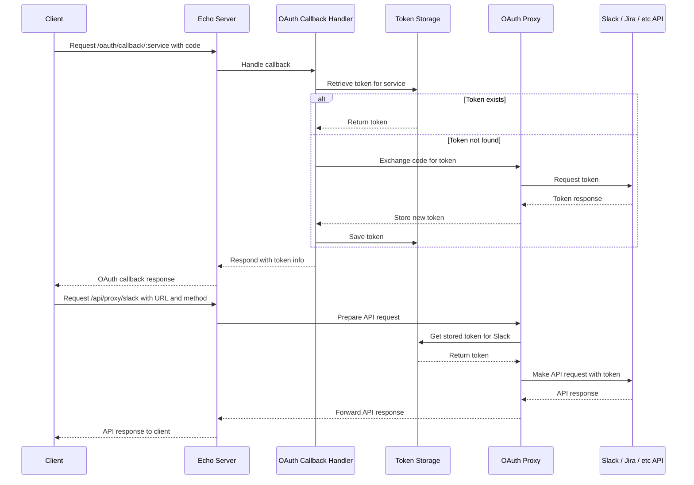

```mermaid
sequenceDiagram
    participant C as Client
    participant E as Echo Server
    participant OCH as OAuth Callback Handler
    participant TS as Token Storage
    participant OP as OAuth Proxy
    participant SA as Slack / Jira / etc API

    C->>E: Request /oauth/callback/:service with code
    E->>OCH: Handle callback
    OCH->>TS: Retrieve token for service
    alt Token exists
        TS-->>OCH: Return token
    else Token not found
        OCH->>OP: Exchange code for token
        OP->>SA: Request token
        SA-->>OP: Token response
        OP-->>OCH: Store new token
        OCH->>TS: Save token
    end
    OCH-->>E: Respond with token info
    E-->>C: OAuth callback response

    C->>E: Request /api/proxy/slack with URL and method
    E->>OP: Prepare API request
    OP->>TS: Get stored token for Slack
    TS-->>OP: Return token
    OP->>SA: Make API request with token
    SA-->>OP: API response
    OP-->>E: Forward API response
    E-->>C: API response to client

```

###
